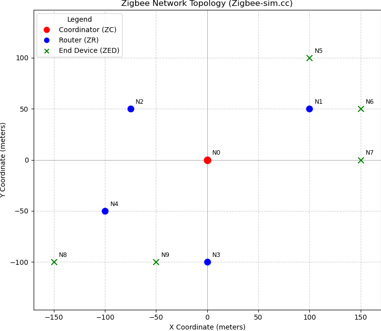

# NS-3 Zigbee Mesh Routing Simulation (Zigbee-sim)

[](https://www.gnu.org/licenses/old-licenses/gpl-2.0.en.html)

This NS-3 simulation models a Zigbee mesh network with a specific topology, demonstrating network formation, data transmission with route discovery, and performance metric calculation.

**Based on original work by:**
*   Alberto Gallegos Ramonet <alramonet@is.tokushima-u.ac.jp> (Tokushima University, Japan)

**Original source:**
* [Zigbee Network Routing in NS-3](https://www.nsnam.org/docs/release/3.44/doxygen/d1/d54/zigbee-nwk-routing_8cc.html)

**Modifications and extensions by:**
*   Marco Giannatiempo

---

## Overview

This simulation sets up a Zigbee mesh network consisting of 10 nodes: one Coordinator (ZC), four Routers (ZR), and five End Devices (ZED). It demonstrates the following key phases:

1.  **Initialization:**
    *   Creates 10 nodes with IEEE 802.15.4 PHY/MAC layers.
    *   Assigns unique 64-bit extended MAC addresses.
    *   Places nodes at fixed positions in a 2D space (see Topology below).
    *   Establishes a wireless channel using Log-Distance Propagation Loss and Constant Speed Propagation Delay models.

2.  **Network Formation & Joining:**
    *   The Coordinator (Node 0) initiates and forms the network on PAN ID `0xCAFE`.
    *   Routers (Nodes 1-4) and End Devices (Nodes 5-9) sequentially perform network discovery and join the network via association.
    *   Nodes receive their 16-bit short network addresses dynamically from their parent upon joining.
    *   Routers enable their routing capabilities after successfully joining.

3.  **Data Transmission:**
    *   After network setup, a configurable source node sends a stream of data packets to a configurable destination node over a defined period.
    *   Route discovery (`ENABLE_ROUTE_DISCOVERY`) is activated for data requests, allowing the network to dynamically find paths if needed.

4.  **Monitoring & Analysis:**
    *   Callbacks monitor network events (joins, data reception).
    *   A custom `PacketIdTag` is added to each data packet to track it individually.
    *   Send times are recorded, and end-to-end delay is calculated upon reception for each tagged packet.

5.  **Results:**
    *   At the end of the simulation run, key performance metrics are calculated and printed:
        *   Packet Delivery Ratio (PDR)
        *   Average, Minimum, and Maximum End-to-End Latency
        *   Jitter (calculated as the standard deviation of latency)
    *   The Neighbor Table and Routing Table of a configurable node (`inspectStack`) are printed.
    *   A TraceRoute is performed between the source and destination nodes to visualize the path used near the end of the simulation.

---

## Network Details

*   **Network Extended PAN ID:** `0x000000000000CAFE` (derived from Coordinator's address)
*   **Channel Scan:** Nodes initially scan channels 11-14 (`0x00007800`).
*   **Device Roles & Addresses:**
    *   **Coordinator (ZC):** Node 0 (`00:...:CA:FE`)
    *   **Routers (ZR):** Node 1 (`00:...:00:01`), Node 2 (`00:...:00:02`), Node 3 (`00:...:00:03`), Node 4 (`00:...:00:04`)
    *   **End Devices (ZED):** Node 5 (`00:...:00:05`), Node 6 (`00:...:00:06`), Node 7 (`00:...:00:07`), Node 8 (`00:...:00:08`), Node 9 (`00:...:00:09`)
    *(Note: 16-bit short addresses are assigned dynamically)*

---

## Topology

The nodes are placed at fixed coordinates as shown below:




**Legend:**
* ${\textsf{\LARGE\color{red}●}}$ Coordinator (ZC) - Node 0
* ${\textsf{\LARGE\color{blue}●}}$ Router (ZR) - Nodes 1-4
* ${\textsf{\color{green}✖}\space}$ End Device (ZED) - Nodes 5-9   

 

---

## Configuration

Key simulation parameters can be easily modified within the `main` function in the C++ code:

*   **Source Node:** `sourceStack = zstackX;` (e.g., `zstack4` for Node 4)
*   **Destination Node:** `destinationStack = zstackY;` (e.g., `zstack6` for Node 6)
*   **Node for Table Inspection:** `inspectStack = zstackZ;` (e.g., `zstack1` for Node 1)
*   **Data Transmission:**
    *   `startTime`: Time (seconds) to start sending packets.
    *   `interval`: Time (seconds) between consecutive packets.
    *   `numPacketsToSend`: Total number of packets to send.

---

## Running the Simulation

1.  **Prerequisites:** Ensure you have a working NS-3 installation with the `lr-wpan` and `zigbee` modules enabled.
2.  **Compilation:** Place the `Zigbee-sim.cc` (or renamed file) in the `scratch` directory of your NS-3 installation. Compile NS-3 using `./ns3 build`.
3.  **Execution:** Run the simulation from the top-level NS-3 directory:
    ```bash
    ./ns3 run <your_simulation_filename>
    ```
    (Replace `<your_simulation_filename>` with the actual name, e.g., `Zigbee-sim`).

The simulation output, including network join events, data reception logs, final performance metrics, tables, and TraceRoute results, will be printed to the console.

---

## License

This project is licensed under the **GNU General Public License v2.0 only**.